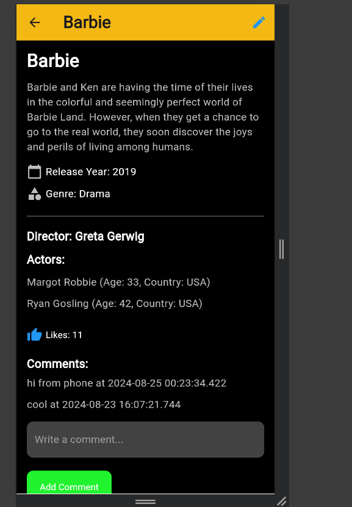

# Movie Library Mobile App

## Description
This mobile app provides a simple interface to browse and manage movies. Users can view movie details, like movies, add comments, and edit movie information.

## Features
- View movie details
- Edit movies (title, description, genre, year, etc.)
- Like and comment on movies
- Actors management

## Technologies
- Flutter (Dart)
- API integration with the website backend

## Installation
1. **Clone the repository**:
   ```bash
   git clone https://github.com/omermohammed9/Movie_Library_Mobile_App.git

2. **Navigate to the project folder:**
   ```bash
     cd movie-library-mobile-app

3. **Install dependencies:**
   ```bash
    flutter pub get

4. **Run the app:**
   ```bash
   flutter run

## API Integration
The mobile app interacts with the backend API of the Movie Library website to fetch and manage movie data, ensuring real-time updates and synchronization across platforms.


# Screenshots

## Overview
This section provides a visual tour of the Movie Library Mobile App, highlighting key features and interfaces.

### Home Screen
- **Description**: Displays a list of movies available in the library.
  

### Movie Details Screen-1
- **Description**: Shows detailed information about a selected movie.
- **Image**:
  

  ### Movie Details Screen-2
- **Description**: Shows detailed information about a selected movie.
- **Image**:
  

### Edit Movie Screen
- **Description**: Interface for adding a new movie or editing an existing one.
- **Image**:
  


